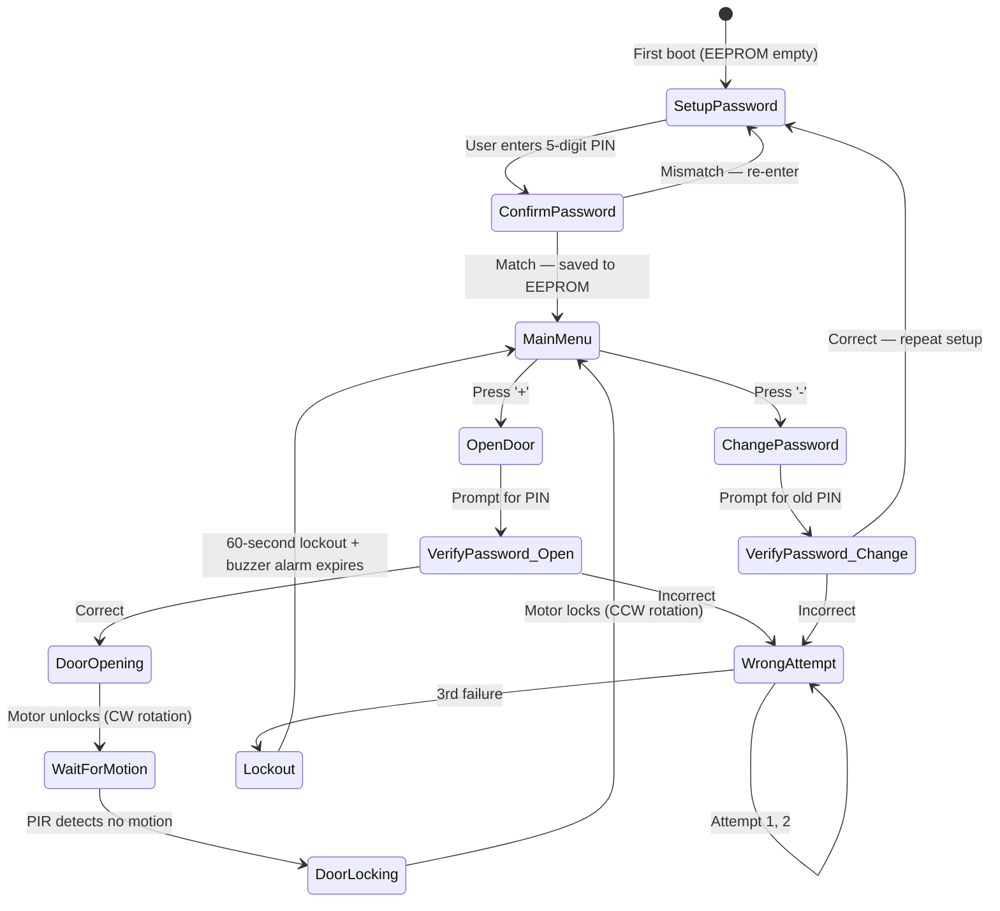

<div align="center">

# 🔐 Door Locker Security System

**Dual-MCU embedded security system built from bare metal — no libraries, no shortcuts.**

[](https://github.com/Youssef2508/door-locker-security-system)
[](https://github.com/Youssef2508/door-locker-security-system)
[](https://github.com/Youssef2508/door-locker-security-system)
[](https://github.com/Youssef2508/door-locker-security-system)
[](https://github.com/Youssef2508/door-locker-security-system)

</div>

---

## What This Is

A smart door control system built on two ATmega32 microcontrollers communicating over UART — one handles the user interface, the other handles all security logic and hardware control. Every driver in this system was written from scratch in Embedded C: GPIO, UART, I2C, Timer, PWM, EEPROM, keypad, LCD, motor control, and PIR sensing.

The defining constraint I gave myself: **the application layer touches zero hardware directly.** All hardware access goes through the HAL, which goes through the MCAL. If you swapped the ATmega32 for a different MCU tomorrow, the application code would not change.

---

## System Architecture

The system is split into two ECUs with clearly separated responsibilities:

```
┌─────────────────────────────────────┐     UART      ┌─────────────────────────────────────┐
│           HMI_ECU                   │◄─────────────►│         Control_ECU                 │
│        (User Interface)             │               │     (Processing & Control)          │
│                                     │               │                                     │
│  ┌──────────┐   ┌──────────────┐    │               │  ┌──────────┐   ┌───────────────┐   │
│  │  Keypad  │   │  LCD 16×2    │    │               │  │  EEPROM  │   │  DC Motor +   │   │
│  │  (4×4)   │   │              │    │               │  │  (I2C)   │   │  H-Bridge     │   │
│  └──────────┘   └──────────────┘    │               │  └──────────┘   └───────────────┘   │
│                                     │               │                                     │
│  ┌──────────────────────────────┐   │               │  ┌──────────┐   ┌───────────────┐   │
│  │  Timer (LCD message timing)  │   │               │  │  PIR     │   │  Buzzer       │   │
│  └──────────────────────────────┘   │               │  │  Sensor  │   │               │   │
│                                     │               │  └──────────┘   └───────────────┘   │
│  Clock: 8 MHz                       │               │                                     │
└─────────────────────────────────────┘               │  ┌──────────────────────────────┐   │
                                                      │  │  Timer (motor timing,        │   │
                                                      │  │  lockout countdown)          │   │
                                                      │  └──────────────────────────────┘   │
                                                      │  Clock: 8 MHz                       │
                                                      └─────────────────────────────────────┘
```

---

## Layered Architecture

Every module lives exactly one level above its dependency — nothing talks to hardware it doesn't own.

```
┌──────────────────────────────────────────────────────────┐
│                   APPLICATION LAYER                      │
│          (main.c — HMI logic / Control logic)            │
│   No hardware registers. No direct peripheral access.    │
└────────────────────┬─────────────────────────────────────┘
                     │ calls
┌────────────────────▼─────────────────────────────────────┐
│             HARDWARE ABSTRACTION LAYER (HAL)             │
│     LCD · Keypad · EEPROM · DC Motor · PIR · Buzzer      │
│   Device-specific logic, protocol-agnostic interfaces.   │
└────────────────────┬─────────────────────────────────────┘
                     │ calls
┌────────────────────▼─────────────────────────────────────┐
│      MICROCONTROLLER ABSTRACTION LAYER (MCAL)            │
│        GPIO · UART · I2C (TWI) · Timer · PWM             │
│      Register-level drivers. No business logic.          │
└────────────────────┬─────────────────────────────────────┘
                     │ writes to
┌────────────────────▼─────────────────────────────────────┐
│                    HARDWARE                              │
│                 ATmega32 Registers                       │
└──────────────────────────────────────────────────────────┘
```

**Driver dependency chain (Control_ECU):**

```
Application
    └── EEPROM (HAL)
            └── I2C / TWI (MCAL)
                    └── GPIO (MCAL)
    └── DC Motor (HAL)
            └── PWM (MCAL) ← Timer0 Fast PWM mode
                    └── GPIO (MCAL)
    └── PIR (HAL)
            └── GPIO (MCAL)
    └── Timer (MCAL) ← interrupt-driven, callback-based
```

---

## System State Machine



---

## UART Communication Protocol

The two ECUs communicate via a simple handshake protocol over UART (9600 baud, 8-bit, 1 stop bit, no parity):

| HMI sends | Meaning | Control responds |
|---|---|---|
| `0x01` | Password digit stream (5 bytes) | `PASS_MATCH` or `PASS_MISMATCH` |
| `0x02` | Open door request | `DOOR_OPEN_ACK` |
| `0x03` | Change password request | `CHANGE_ACK` |
| `0x04` | PIR poll | `MOTION_DETECTED` or `NO_MOTION` |

HMI never acts on door hardware directly — it sends intent, Control validates and executes.

---

## Password Storage (EEPROM via I2C)

Password bytes are stored at fixed addresses in the external EEPROM. I2C (TWI) is used exclusively inside the EEPROM driver — the application has no awareness of I2C. The EEPROM driver exposes only:

```c
void EEPROM_writeByte(uint16_t address, uint8_t data);
uint8_t EEPROM_readByte(uint16_t address);
```

The `I2C_init()`, `I2C_start()`, `I2C_write()`, and `I2C_read()` calls are encapsulated entirely inside the EEPROM `.c` file.

---

## Timer Driver Design

The timer driver is built on enumerations and structs for clean configurability — no magic numbers anywhere in the application:

```c
typedef enum {
    TIMER0, TIMER1, TIMER2
} Timer_ID;

typedef enum {
    NORMAL_MODE,
    CTC_MODE,
    FAST_PWM_MODE,
    PHASE_CORRECT_PWM_MODE
} Timer_Mode;

typedef struct {
    Timer_ID    timer_id;
    Timer_Mode  mode;
    uint32_t    initial_value;
    uint32_t    compare_value;
    void (*callback)(void);   /* ISR callback — no logic in the ISR itself */
} Timer_ConfigType;
```

The HMI ECU uses the timer to control how long messages stay on the LCD. The Control ECU uses it to time the motor run duration and the 60-second lockout period.

---

## Key Features

- **Password authentication** — 5-digit PIN, stored in external EEPROM
- **Dual-ECU separation** — UI concerns never mix with control concerns
- **Motor control** — H-bridge with Fast PWM (Timer0); CW to unlock, CCW to lock
- **PIR-based auto-lock** — door stays open until no motion is detected
- **Security lockout** — 3 wrong attempts triggers 60-second buzzer alarm and input freeze
- **Password change flow** — requires old password verification before accepting new
- **Interrupt-driven timer** — no polling delays; callback-based timing throughout

---

## Project Structure

```
door-locker-security-system/
├── Code/
│   └── Final_Project_Eclipse_WS/
│       ├── HMI_ECU/
│       │   ├── MCAL/          ← GPIO, UART, Timer (register-level)
│       │   ├── HAL/           ← LCD, Keypad
│       │   └── APP/           ← main.c — user interaction logic only
│       └── Control_ECU/
│           ├── MCAL/          ← GPIO, UART, I2C, Timer, PWM
│           ├── HAL/           ← EEPROM, DC Motor, PIR, Buzzer
│           └── APP/           ← main.c — validation and control logic only
└── Simulation/
    └── Final_Project_Proteus_Simulation/
```

---

## Hardware Specifications

| Component | Spec |
|---|---|
| MCU | ATmega32 (×2) |
| Clock | 8 MHz |
| UART | 9600 baud, 8N1 |
| I2C | 400 kHz (Fast Mode) |
| PWM | Timer0 Fast PWM, ~7.8 kHz |
| EEPROM | 24C16 or equivalent (I2C) |
| Motor driver | L293D H-Bridge |
| Display | LCD 16×2 |
| Input | Keypad 4×4 |
| Motion | PIR HC-SR501 |

---

## Why I Built It This Way

> *This section is the part I'd want to read if I picked up someone else's embedded project.*

**On the dual-ECU split:** Putting everything on one MCU was the simpler path. I chose two because the architectural discipline is more valuable than the shortcut. An HMI ECU should not know how a motor is controlled. A Control ECU should not care which keypad library you're using. The UART boundary forces you to think about what's a command and what's a response — which is exactly how real embedded systems (automotive ECUs, industrial controllers) are organised.

**On writing all drivers from scratch:** I could have used UART libraries or Arduino-style abstractions. The point of this project was to understand what happens at the register level — what `UCSRB |= (1 << RXCIE)` actually means, why Fast PWM needs `WGM00` and `WGM01` both set, what the TWI status register codes mean at each I2C phase. You can't debug a library you don't understand.

**On the layered architecture (MCAL / HAL / APP):** The constraint I set was: if I ever swapped ATmega32 for an STM32, only the MCAL changes. Everything above it survives unchanged. This isn't theoretical — I designed the driver structs and enums to be MCU-agnostic at the API level, even though the implementation is ATmega32-specific.

**On the callback-based timer:** Putting application logic inside an ISR is a common beginner mistake. The timer driver stores a function pointer and calls it from the ISR — the ISR itself has exactly two lines. This keeps timing logic testable and prevents the ISR from growing into a maintenance problem.

**On I2C inside EEPROM only:** The application doesn't know I2C exists. It calls `EEPROM_writeByte()` and `EEPROM_readByte()`. This means if I ever switched to an SPI-based EEPROM, zero application code changes — only the EEPROM driver's `.c` file gets rewritten. This is what encapsulation is supposed to buy you.

---

## How to Run

**Simulation (Proteus):**
1. Open the `.pdsprj` file from `Simulation/Final_Project_Proteus_Simulation/`
2. Make sure both ATmega32 hex files are linked (one per MCU)
3. Run the simulation — interact via the keypad widget

**Real hardware:**
1. Open both ECU projects in Atmel Studio or AVR-GCC
2. Compile each separately → generates individual `.hex` files
3. Flash HMI_ECU hex to first ATmega32, Control_ECU hex to second
4. Connect UART TX/RX between the two boards (cross-connected)
5. Power both boards; keypad interaction begins immediately

---

## Author

**Youssef Hassan** — Computer Science, Cairo University (2026)
Backend & Embedded Systems Engineer · ECPC Competitor

[](https://linkedin.com/in/youssef-hassan-bab3912b9)
[](https://github.com/Youssef2508)
